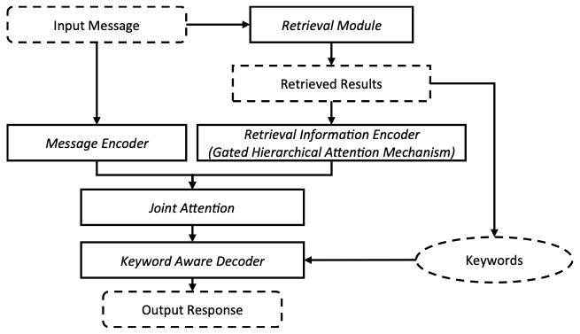
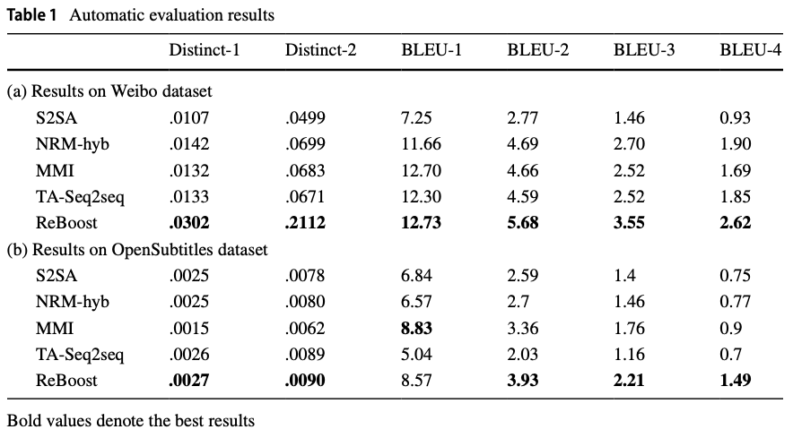
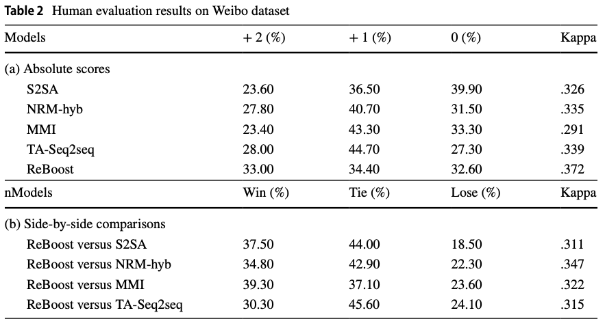

# ReBoost: A Retrieval-Boosted Sequence-to-Sequence Model for Neural Response Generation
This repository contains the source code and datasets for the IR Journal paper [ReBoost: A Retrieval-Boosted Sequence-to-Sequence Model for Neural Response Generation](https://link.springer.com/content/pdf/10.1007%2Fs10791-019-09364-x.pdf) by Zhu et al. <br>

## Model overview


## Results



## Dependencies
Python 3.5 <br>
Tensorflow 1.2.0

## Datasets
Your can download the processed datasets used in our paper here and unzip it to the folder of ```data```. <br>
[Ubuntu_V1](https://drive.google.com/open?id=1-rNv34hLoZr300JF3v7nuLswM7GRqeNc) <br>
[Ubuntu_V2](https://drive.google.com/open?id=1tS_VC47z8CVPr-tZu0U4JEEwBT04N6ks) <br>

## Train a new model
Take Ubuntu_V1 as an example.
```
cd scripts
bash ubuntu_train.sh
```
The training process is recorded in ```log_train_IMN_UbuntuV1.txt``` file.

## Test a trained model
```
bash ubuntu_test.sh
```
The testing process is recorded in ```log_test_IMN_UbuntuV1.txt``` file. And your can get a ```ubuntu_test_out.txt``` file which records scores for each context-response pair. Run the following command and you can compute the metric of Recall.
```
python compute_recall.py
```

## Cite
If you use the code and datasets, please cite the following paper:  
**"ReBoost: A Retrieval-Boosted Sequence-to-Sequence Model for Neural Response Generation"**  
Yutao Zhu, Zhicheng Dou, Jian-Yun Nie and Ji-Rong Wen. _IR Journal (2019)_

```
@article{DBLP:journals/ir/ZhuDNW20,
  author    = {Yutao Zhu and
               Zhicheng Dou and
               Jian{-}Yun Nie and
               Ji{-}Rong Wen},
  title     = {ReBoost: a retrieval-boosted sequence-to-sequence model for neural
               response generation},
  journal   = {Inf. Retr. Journal},
  volume    = {23},
  number    = {1},
  pages     = {27--48},
  year      = {2020},
  url       = {https://doi.org/10.1007/s10791-019-09364-x},
  doi       = {10.1007/s10791-019-09364-x}
}
```
